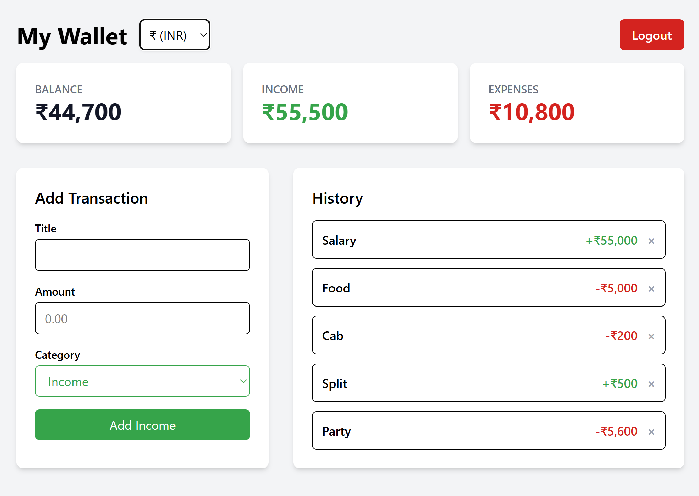

# Expense Tracker

A clean and simple full-stack application for tracking your personal finances. Register an account, log your income and expenses, and get an instant summary of your financial health.

This project is a monorepo containing a React (Vite + Tailwind) frontend (`web`) and a Node.js (Express) backend (`backend`).

## ✨ Live Demo

**Link:** [https://expense-tracker-proj.onrender.com/](https://expense-tracker-proj.onrender.com/)



## 🚀 Features

* **🔐 Secure User Authentication:** Register and log in with a JWT-based (JSON Web Token) auth system.
* **💸 Transaction Management:** Full CRUD (Create, Read, Delete) functionality for transactions.
* **📊 Dashboard Summary:** Instantly see your total balance, total income, and total expenses.
* **📜 Transaction History:** A scrollable list of all your past transactions, sorted by date.
* **🎨 Dynamic UI:** The transaction form highlights "Income" in green and "Expense" in red for clarity.
* **🌍 Currency Picker:** Choose your preferred currency symbol ($, €, £, ₹, ¥) for display.
* **🛡️ Rate Limiting:** The backend uses Upstash (Redis) to limit API requests and prevent abuse.

## 🛠️ Tech Stack

* **Frontend (`/web`):**
    * React (with Vite)
    * Tailwind CSS
    * React Router
    * Axios
* **Backend (`/backend`):**
    * Node.js
    * Express.js
    * PostgreSQL (using `@vercel/postgres`)
    * `bcrypt.js` (for password hashing)
    * `jsonwebtoken` (for auth tokens)
    * `cors`
* **Rate Limiting:**
    * Upstash (Serverless Redis)
* **Deployment:**
    * Render

## 📦 Getting Started (Local Setup)

Follow these instructions to get a copy of the project up and running on your local machine.

### Prerequisites

* [Node.js](https://nodejs.org/) (v18 or later)
* [PostgreSQL](https://www.postgresql.org/download/) installed and running.
* An [Upstash](https://upstash.com/) account (for Redis rate limiting).

## 1. Clone the Repository

```bash
git clone [https://github.com/your-username/expense-tracker.git](https://github.com/your-username/expense-tracker.git)
cd expense-tracker
```

## 2. Backend Setup
Navigate to the backend directory:

```Bash

cd backend
```
Install dependencies:

```Bash

npm install
```
Create your database in PostgreSQL.

Create a .env file in the backend folder and add the required environment variables (see .env.example section below).

Start the backend server:

```Bash

npm run dev
```
The server will be running on http://localhost:3001 (or your specified PORT).

## 3. Frontend Setup
From the root directory, navigate to the frontend directory:

```Bash

cd web
```
Install dependencies:

```Bash

npm install
```
Start the frontend dev server:

```Bash

npm run dev
```
The application will be running on http://localhost:5173.

## ⚙️ Environment Variables
The backend requires the following environment variables. Create a .env file in the /backend directory.

Code snippet

#### .env.example

#### PostgreSQL Connection String
#### Get this from your database provider (e.g., Supabase, Neon, or local install)
POSTGRES_URL="your_postgresql_connection_string"

#### JWT Secret Key
JWT_SECRET="your_super_strong_and_random_secret_key"

#### Server Port (optional, defaults to 3001)
PORT=3001

#### Upstash Redis Credentials (for rate limiting)
UPSTASH_REDIS_REST_URL="your_upstash_redis_url"
UPSTASH_REDIS_REST_TOKEN="your_upstash_redis_token"
## 📝 API Endpoints
All transaction routes are protected and require a Bearer <token> in the Authorization header.

### Auth
POST /api/auth/register - Register a new user.

POST /api/auth/login - Log in and receive a JWT.

### Transactions
GET /api/transactions - Get all transactions for the logged-in user.

POST /api/transactions - Create a new transaction.

DELETE /api/transactions/:id - Delete a transaction by its ID.

GET /api/transactions/summary - Get the { balance, income, expenses } summary for the user.

## 🚀 Deployment on Render
This project is configured for a simple deployment on Render as a single "Web Service".

Root Directory: (blank)

Build Command: npm install --prefix web && npm run build --prefix web && npm install --prefix backend

Start Command: node backend/src/server.js

The server is pre-configured to serve the static frontend files from the web/dist folder alongside the backend API.
